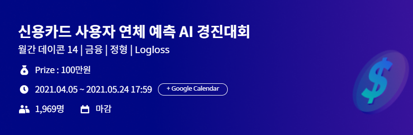

# 신용카드 사용자 연체 예측 AI 실습 💳

 

## 🗒️ Contributors
| Name         | Link                           | Descript                           |
| :---------:   |  :-------------------:        |  :---------: |
| 최병휘        | [[2조]최병휘_5주차.ipynb]()     |   |
| 전지은        | [[2조]전지은_5주차.ipynb](https://github.com/AIFFEL-GN-2nd/PayMeBack/blob/main/1%EC%A3%BC%EC%B0%A8/%5B2%EC%A1%B0%5D%EC%A0%84%EC%A7%80%EC%9D%80_5%EC%A3%BC%EC%B0%A8.ipynb)     |  |
| 손한성        | [[2조]손한성_5주차.ipynb]()     |  |
| 신예린        | [[2조]신예린_5주차.ipynb](https://github.com/AIFFEL-GN-2nd/PayMeBack/blob/main/1%EC%A3%BC%EC%B0%A8/%5B2%EC%A1%B0%5D%EC%8B%A0%EC%98%88%EB%A6%B0_5%EC%A3%BC%EC%B0%A8.ipynb)     |  |
| 이서윤        | [[2조]이서윤_5주차.ipynb]()     |  |
| 안형준        | [[2조]안형준_5주차.ipynb](https://github.com/AIFFEL-GN-2nd/PayMeBack/blob/main/1%EC%A3%BC%EC%B0%A8/%5B2%EC%A1%B0%5D%EC%95%88%ED%98%95%EC%A4%80_5%EC%A3%BC%EC%B0%A8.ipynb)     |  |
| 최혜림        | [[2조]최혜림_5주차.ipynb](https://github.com/AIFFEL-GN-2nd/PayMeBack/blob/main/1%EC%A3%BC%EC%B0%A8/%5B2%EC%A1%B0%5D%EC%B5%9C%ED%98%9C%EB%A6%BC_5%EC%A3%BC%EC%B0%A8.ipynb)     |  |
| 박기민        | [[2조]박기민_5주차.ipynb](https://github.com/AIFFEL-GN-2nd/PayMeBack/blob/main/1%EC%A3%BC%EC%B0%A8/%5B2%EC%A1%B0%5D%EB%B0%95%EA%B8%B0%EB%AF%BC_5%EC%A3%BC%EC%B0%A8.ipynb)     |  |

 

## 🗒️ Content

### □ **데이터 정보**

[데이터 변수 설명](https://www.dacon.io/competitions/official/235713/talkboard/402821/)  

**gender**: 성별

**car**: 차량 소유 여부

**reality**: 부동산 소유 여부

**child_num**: 자녀 수

**income_total**: 연간 소득

**income_type**: 소득 분류

**edu_type**: 교육 수준

**family_type**: 결혼 여부

**house_type**: 생활 방식

**DAYS_BIRTH**: 출생일

**DAYS_EMPLOYED**: 업무 시작일

**FLAG_MOBIL**: 핸드폰 소유 여부

**work_phone**: 업무용 전화 소유 여부

**phone**: 전화 소유 여부

**email**: 이메일 소유 여부

**occyp_type**: 직업 유형													
**family_size**: 가족 규모

**begin_month**: 신용카드 발급 월

 

## 🗒️ Overview

### □ Purpose

 

- 신용카드 사용자 데이터를 보고 사용자의 대금 연체 정도를 예측하는 알고리즘 개발 

 

### □ 진행 요약

#### 1주차

1. 데이터에 대한 토론
2. 각자 EDA를 한 내용 공유
3. 앞으로 어떤 목표를 가지고 진행할 지 얘기하기
    - 자신 만의 아이디어 추가
    - 여러가지 방식 적용해보기
    - 다양한 라이브러리 사용해보기 (panda, seaborn ...)

#### 2주차

1. 각자 진행한 노트북들을 모두 공개하고, 인기투표가 진행
2. 가장 인기가 좋았던 노트북을 다른 사람들에게 이야기해주는 시간